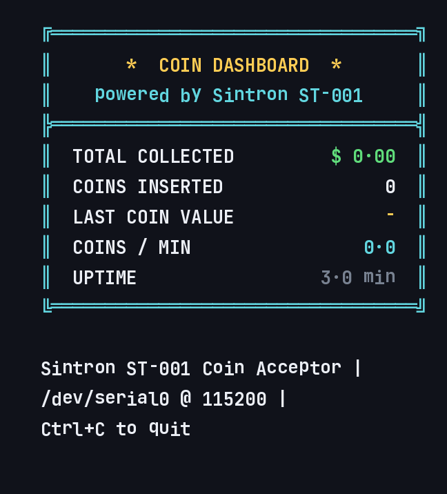
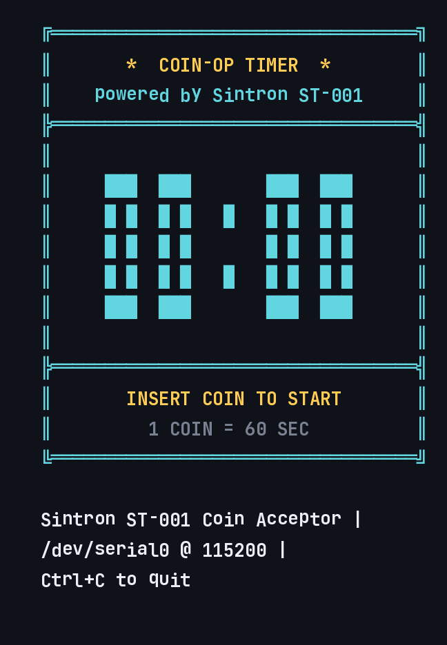
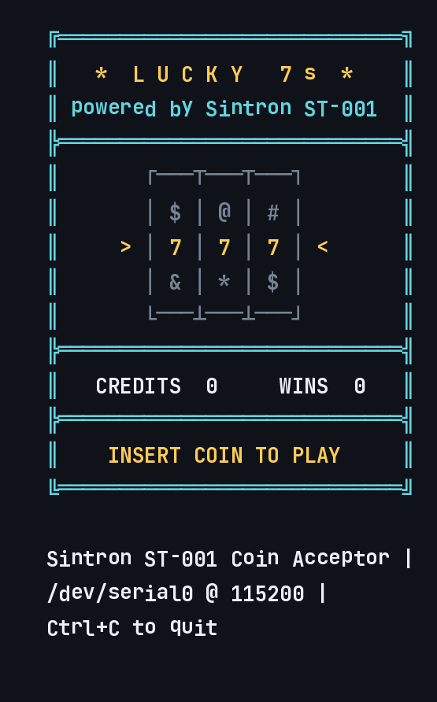
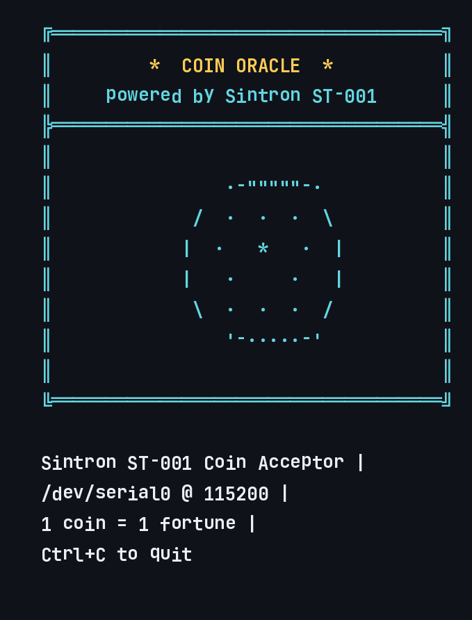
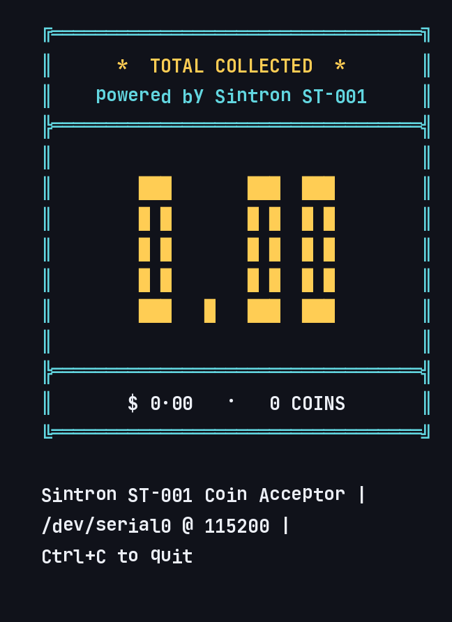
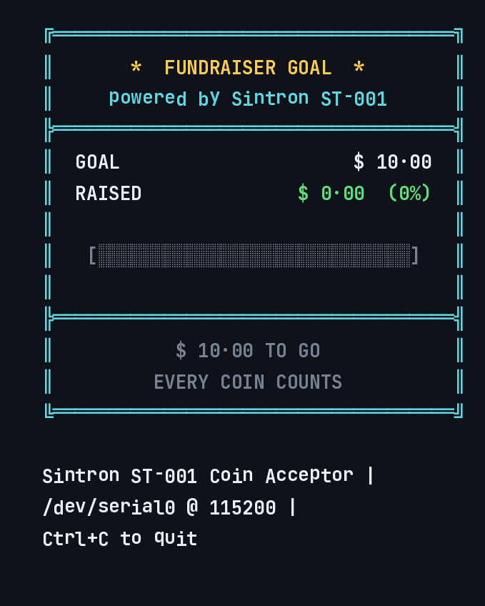
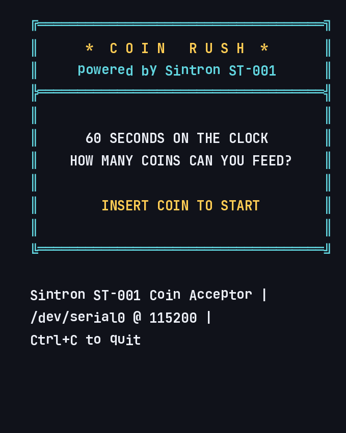
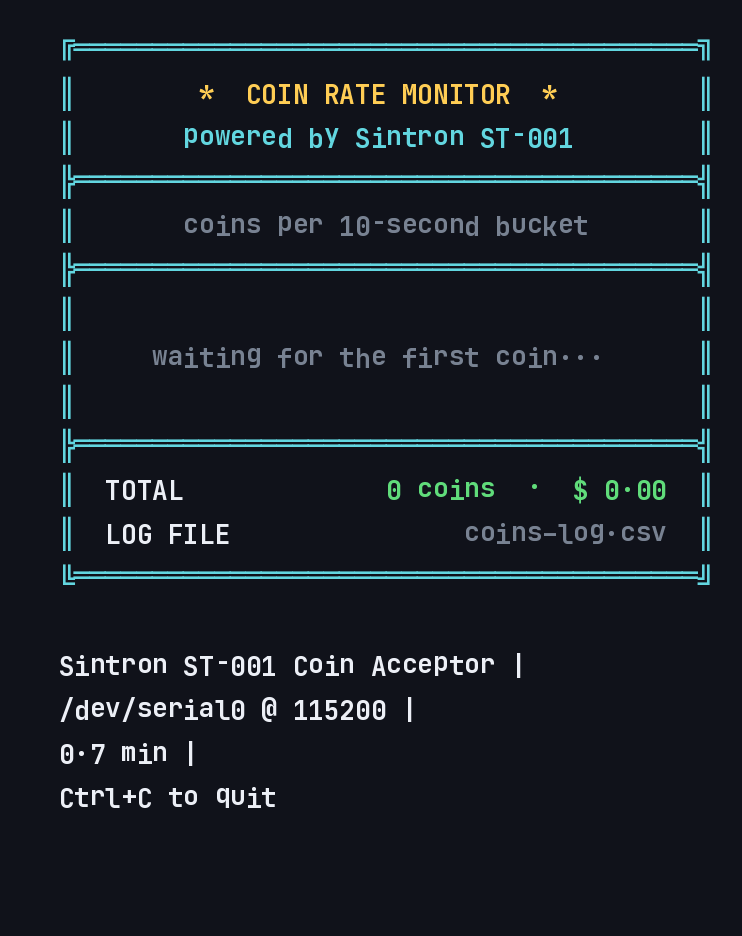
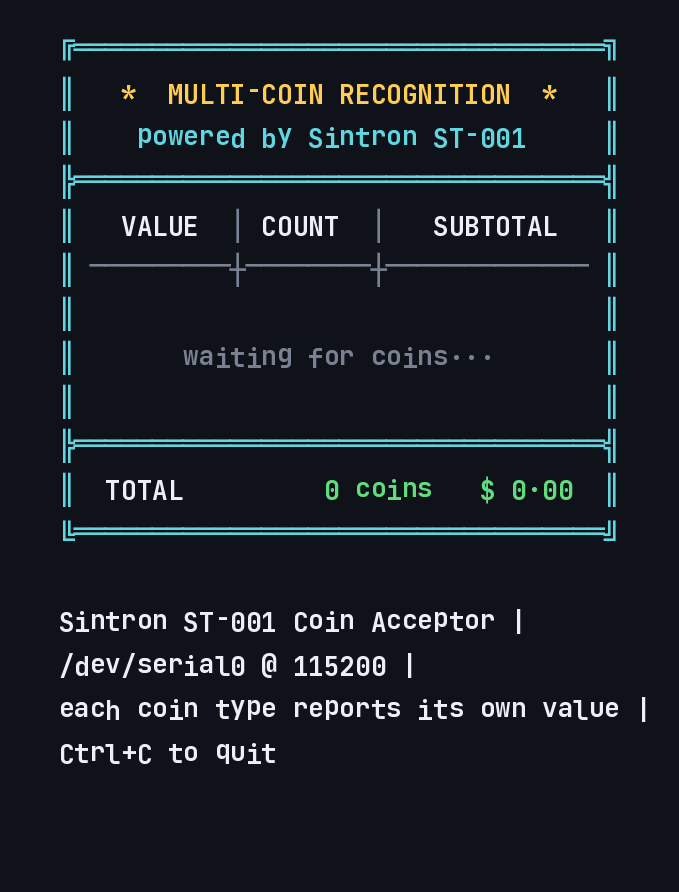

# Coin Machine Toolkit — Sintron ST-001 × Raspberry Pi 🪙

**Turn any Raspberry Pi into a coin-operated machine.**

9 retro terminal apps, all triggered by real coins through a **Sintron ST-001 multi-coin acceptor**: a slot machine, a coin-op timer, a live revenue dashboard, a 60-second coin challenge, multi-coin recognition and more. Pure Python, standard library only.

**No hardware yet?** Every tool also runs in **demo mode** on any Mac / PC / Linux box — press **Enter** to simulate a coin. Try the software first, wire it later.

| | | |
|---|---|---|
|  |  |  |
|  |  |  |
|  |  |  |

---

## Contents

- [The 9 tools](#the-9-tools)
- [Try it now — demo mode](#try-it-now--demo-mode-any-computer)
- [Why the Sintron ST-001?](#why-the-sintron-st-001)
- [Hardware setup (Raspberry Pi)](#hardware-setup-raspberry-pi)
- [The serial protocol](#the-serial-protocol-for-makers)
- [Troubleshooting](#troubleshooting)
- [Make it yours](#make-it-yours)

## The 9 tools

| # | File | What happens when you drop a coin |
|---|------|-----------------------------------|
| 01 | `01_dashboard.py` | Live dashboard updates: total collected, coin count, last coin value, coins/min, uptime |
| 02 | `02_timer.py` | Big digits add time and count down to TIME UP — the classic coin-op timer (`python3 02_timer.py 600` = 10 min per coin) |
| 03 | `03_slot.py` | Lucky 7s: 3×3 reels spin and lock left-to-right — match 3 on the payline, 7-7-7 = jackpot |
| 04 | `04_fortune.py` | The crystal ball glows and reveals your fortune |
| 05 | `05_bigboard.py` | Casino-style giant digits flash green and jump to the new total |
| 06 | `06_fundraiser.py` | Progress bar climbs toward the goal, then the machine celebrates (`python3 06_fundraiser.py 50` = $50 goal) |
| 07 | `07_challenge.py` | Coin Rush: 60 seconds on the clock — how many coins can you feed? Graded S/A/B/C |
| 08 | `08_chart.py` | Every coin is logged to `coins_log.csv` + a live rate bar chart (pandas-ready) |
| 09 | `09_denominations.py` | **Multi-coin recognition**: each coin type reports its own programmed value — counted and subtotaled live |

All coin input flows through one file: **`coinlib.py`**.

## Try it now — demo mode (any computer)

```bash
git clone https://github.com/junny0204/coin-machine-toolkit.git
cd coin-machine-toolkit
python3 03_slot.py
```

- **Enter** = insert one coin
- Type a value first (e.g. `30`) to simulate a specific coin type
- **Ctrl+C** = quit

Nothing to install — Python standard library only.

## Why the Sintron ST-001?

The ST-001 is a programmable **multi-coin acceptor** designed to be maker-friendly:

- **Recognizes multiple coin types** — train it on your coins (any currency), assign each type its own value
- **Reports, not just pulses** — in serial mode every coin arrives as one clean, human-readable line with the value *you* programmed
- **Trivial to integrate** — 115200 baud UART; works with Raspberry Pi, Arduino, ESP32, or anything with a serial port; parsing is a one-line regex
- **Real-machine grade** — the same acceptor used in arcade, vending, laundry and kiosk builds

**Get one:**
- 🛒 Amazon (US): [amazon.com/dp/B0FL19CS85](https://www.amazon.com/dp/B0FL19CS85/)
- 🌏 Direct: [sintron-hk.com](https://www.sintron-hk.com)

## Hardware setup (Raspberry Pi)

### You need

- Raspberry Pi (any model with a GPIO header — Pi 1 through Pi 5, Zero included)
- Sintron ST-001 set to **serial mode**
- DC power supply for the acceptor (per the label on your unit)
- 3 jumper wires

### Wiring

```
   DC supply (+) ─────────►  ST-001  DC IN +
   DC supply (–) ────┬────►  ST-001  GND
                     │
                     └────►  Pi GND          (physical pin 6)
   ST-001  SERIAL TX ─────►  Pi RXD / GPIO15 (physical pin 10)
```

Two rules that cover 90% of wiring problems:

1. **Common ground** — the acceptor's GND and the Pi's GND must be connected.
2. **Level check** — the Pi's RX pin is **3.3 V**. If your acceptor's TX output is 5 V, drop it with a simple voltage divider (e.g. 1 kΩ / 2 kΩ) or a level shifter.

### One-time Pi setup: free the serial port

Raspberry Pi OS ships with a **login console on the serial port**. It will steal your coin data — you'll see broken fragments like `b'v'` / `b'cy:213'` instead of full lines. Turn it off once:

```
sudo raspi-config
  → 3 Interface Options → I6 Serial Port
  → "login shell over serial?"      →  No
  → "serial port hardware enabled?" →  Yes
  → Finish → Reboot
```

### Install and test

```bash
sudo apt install -y python3-serial git
git clone https://github.com/junny0204/coin-machine-toolkit.git
cd coin-machine-toolkit

# 1) verify the wiring first
sudo python3 coin_diag.py
#    drop a coin → you should see:  b'value:30,frequency:213\r\n'

# 2) play
sudo python3 03_slot.py
```

> Prefer not to use `sudo`? Run `sudo usermod -aG dialout $USER`, log out and back in.

`coinlib.py` **auto-detects** the acceptor: if `/dev/serial0` opens, real coins drive everything; otherwise the tools fall back to keyboard demo mode. The status lines at the bottom of every tool tell you which mode you're in:

```
Sintron ST-001 Coin Acceptor |
/dev/serial0 @ 115200 |          ← real coins
Ctrl+C to quit
```

## The serial protocol (for makers)

One line per coin, 115200 baud, 8N1:

```
value:30,frequency:213
```

- `value` — the number **you programmed** into the acceptor for that coin type
- `frequency` — the raw coil reading (used internally for recognition; ignore it)

Roll your own integration in ten lines:

```python
import serial, re
ser = serial.Serial("/dev/serial0", 115200, timeout=1)
coin = re.compile(rb"value:(\d+)")
while True:
    m = coin.search(ser.readline())
    if m:
        print("coin!", int(m.group(1)))   # do anything here
```

## Troubleshooting

| Symptom | Fix |
|---------|-----|
| Coins do nothing, status says `DEMO` | Port didn't open: run with `sudo` (or join `dialout`), and make sure pyserial is installed |
| Coins do nothing, status shows the port | Another program holds the port (`Ctrl+C` it or reboot); check wiring and the acceptor's power LED |
| Broken fragments (`b'v'`, `b'cy:213'`) | Serial login console still on → see [Free the serial port](#one-time-pi-setup-free-the-serial-port) |
| Garbage bytes | Wrong baud — the ST-001 speaks **115200** |
| `Permission denied` | `sudo`, or add yourself to `dialout` |

Still stuck? Run `sudo python3 coin_diag.py` and read what it says — it diagnoses all of the above.

## Make it yours

- Every tool is a single small file; the coin source lives in **`coinlib.py`** (`wait_for_coin` / `poll_coin`) — swap it once, change everything
- `MODE = "keyboard"` in `coinlib.py` forces demo mode; `"serial"` requires the acceptor
- MIT licensed — fork it, ship it, build a product on it

---

*Built by [Sintron Technology](https://www.sintron-hk.com) to show what a coin acceptor can do beyond vending machines.*
